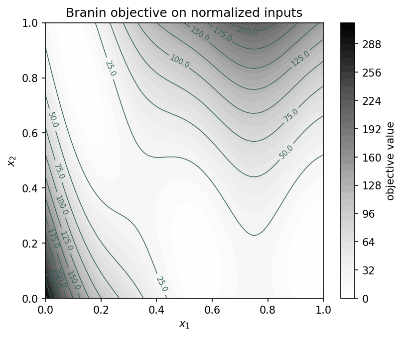

Example 01: computer experiments
================================

Script: ``examples/example01_computer_experiment.py``

Purpose
-------

The script shows two equivalent ways to describe a constrained computer
experiment: separate objective/constraint callables and one combined callable
with output metadata.  It also loads the built-in Branin problem and evaluates
it on normalized inputs.  The Branin function is part of the Virtual Library of
Simulation Experiments test-function collection :cite:p:`surjanovic_bingham`.

What is computed
----------------

- objective and constraint values at two input points.
- objective-only and constraint-only output blocks.
- a Branin contour plot on a grid.

Main objects
------------

- ``gpmpcontrib.ComputerExperiment``
- ``gpmpcontrib.test_problems.branin``

Outputs
-------

Run ``python examples/example01_computer_experiment.py`` from the repository
root to execute the example.  Regenerate the static figure with
``cd docs && python make_example_results.py``.

   Branin contour values come from evaluating the built-in
   ``ComputerExperiment`` on a regular grid.  The two callable definitions used
   earlier in the script print the same objective and constraint blocks at the
   selected test points.  This checks that the normalized input box and
   objective evaluation agree with the problem metadata.

Source excerpt
--------------

.. literalinclude:: ../../../examples/example01_computer_experiment.py
   :language: python
   :lines: 30-79
