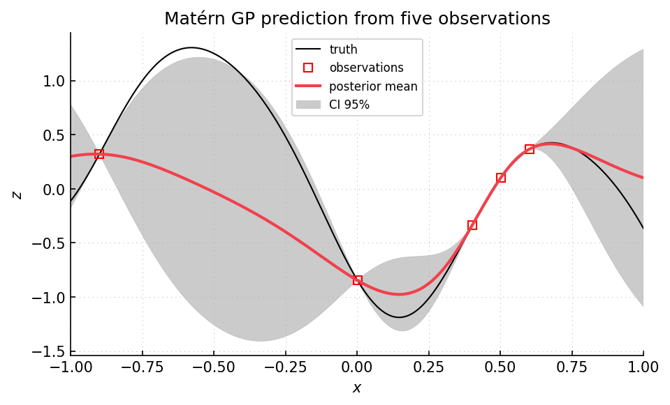

Example 02: models, diagnostics, and prediction
===============================================

Script: ``examples/example02_models.py``

Purpose
-------

The script demonstrates the standard model procedure: build a Matérn model
container, select covariance parameters, compute predictions, run diagnostics,
and visualize the result.  It includes a one-output one-dimensional problem and
a two-output two-dimensional problem.  Matérn covariance models and
likelihood-based parameter selection are standard tools in GP interpolation
:cite:p:`stein1999kriging,chiles1999geostatistics`.  Empirical comparisons of
selection criteria are discussed by :cite:t:`petit2023parameter`.

What is computed
----------------

- selected covariance parameters for each output.
- posterior means and variances on prediction points.
- conditional sample paths for the one-dimensional case.
- leave-one-out predictions and LOO error plots.
- truth-versus-prediction plots for the two-output case.

Main objects
------------

- ``gpmpcontrib.Model_ConstantMean_Maternp_REML``
- ``gpmpcontrib.Model_ConstantMean_Maternp_REMAP``
- ``gpmpcontrib.Model_ConstantMean_Maternp_ML``
- ``gpmpcontrib.plot.plot_1d``
- ``gpmpcontrib.plot.show_truth_vs_prediction``
- ``gpmpcontrib.plot.show_loo_errors``

Outputs
-------

Run ``python examples/example02_models.py`` from the repository root to execute
the example.  Regenerate the static figure with
``cd docs && python make_example_results.py``.

   One-dimensional part: posterior means and variances on a regular grid.  Red
   points are observations, the red curve is the posterior mean, and the shaded
   band is a pointwise 95 percent interval.  The interval widens between
   observations and narrows at observed input locations.  The full script also
   displays leave-one-out errors and truth-versus-prediction plots for the
   two-output case.

Source excerpt
--------------

.. literalinclude:: ../../../examples/example02_models.py
   :language: python
   :lines: 31-77
