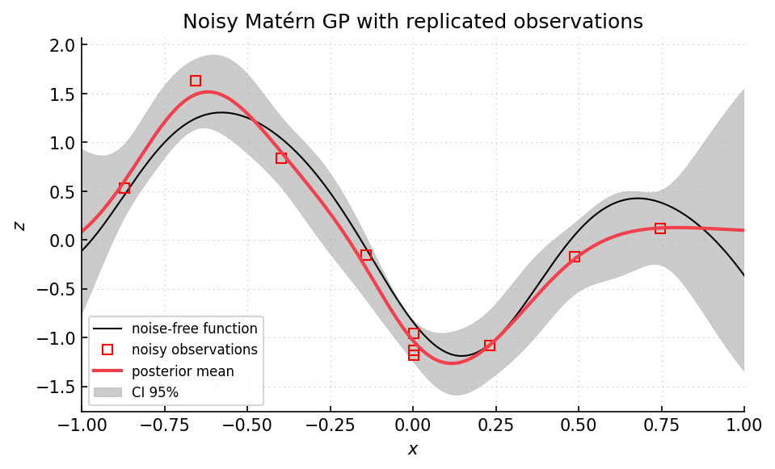

Example 04: noisy sequential prediction
=======================================

Script: ``examples/example04_sequential_prediction_with_noise.py``

Purpose
-------

The script shows how to use ``SequentialPrediction`` with noisy scalar
observations.  The model class is ``Model_Noisy_ConstantMean_Maternp_REML``.
The physical input is augmented with one observation-noise variance column, so
observations and prediction points carry different noise values.  This is the
standard noisy-observation form of GP prediction, with the noise variance added
to the observation covariance :cite:p:`stein1999kriging,chiles1999geostatistics`.

What is computed
----------------

- noisy observations of the one-dimensional ``twobumps`` function.
- covariance parameters selected by noisy REML.
- posterior means and variances at zero-noise prediction points.
- sequential additions selected by maximum posterior variance.
- conditional sample paths from the final noisy model.

Main objects
------------

- ``gpmpcontrib.computerexperiment.StochasticComputerExperiment``
- ``gpmpcontrib.Model_Noisy_ConstantMean_Maternp_REML``
- ``gpmpcontrib.SequentialPrediction``
- ``gpmpcontrib.plot.plot_1d``

Outputs
-------

Run ``python examples/example04_sequential_prediction_with_noise.py`` from the
repository root to execute the example.  Regenerate the static figure with
``cd docs && python make_example_results.py``.

   Red points are noisy observations.  Several observations are replicated at
   the same physical input.  The prediction grid is passed with zero observation
   noise, so the posterior variance represents uncertainty on the latent
   function, not observation noise at a new noisy measurement.

Source excerpt
--------------

.. literalinclude:: ../../../examples/example04_sequential_prediction_with_noise.py
   :language: python
   :lines: 45-86
