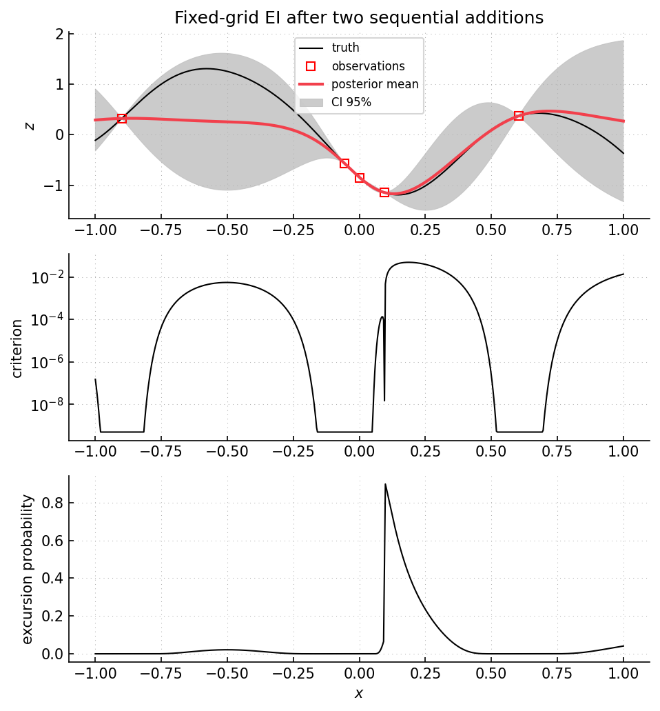

Example 10: expected improvement on a fixed grid
================================================

Script: ``examples/example10_optim_EI_gridsearch.py``

Purpose
-------

The script runs a one-dimensional Bayesian optimization loop on a fixed
candidate grid.  Expected improvement (EI) is evaluated at all grid points, and
the grid point with maximal EI is evaluated next.  EI is the classical criterion
used in efficient global optimization :cite:p:`jones1998ego`.

What is computed
----------------

- posterior mean and variance on the fixed grid.
- current observed minimum.
- EI values computed as ``expected_improvement(-z_best, -zpm, zpv)``.
- posterior excursion probabilities relative to the current observed minimum.
- one new objective evaluation per sequential step.

Main objects
------------

- ``gpmpcontrib.optim.expectedimprovement.ExpectedImprovementGridSearch``
- ``gpmpcontrib.samplingcriteria.expected_improvement``
- ``gpmpcontrib.samplingcriteria.excursion_probability``

Outputs
-------

Run ``python examples/example10_optim_EI_gridsearch.py`` from the repository
root to execute the example.  Regenerate the static figure with
``cd docs && python make_example_results.py``.

   Top panel: current GP posterior and observations after two sequential
   additions.  Middle panel: EI on the fixed candidate grid, shown on a log
   scale.  Peaks occur where posterior uncertainty and possible improvement are
   both present.  Lower panel: excursion probability associated with the sign
   convention used by the EI computation.

Source excerpt
--------------

.. literalinclude:: ../../../examples/example10_optim_EI_gridsearch.py
   :language: python
   :lines: 54-91
