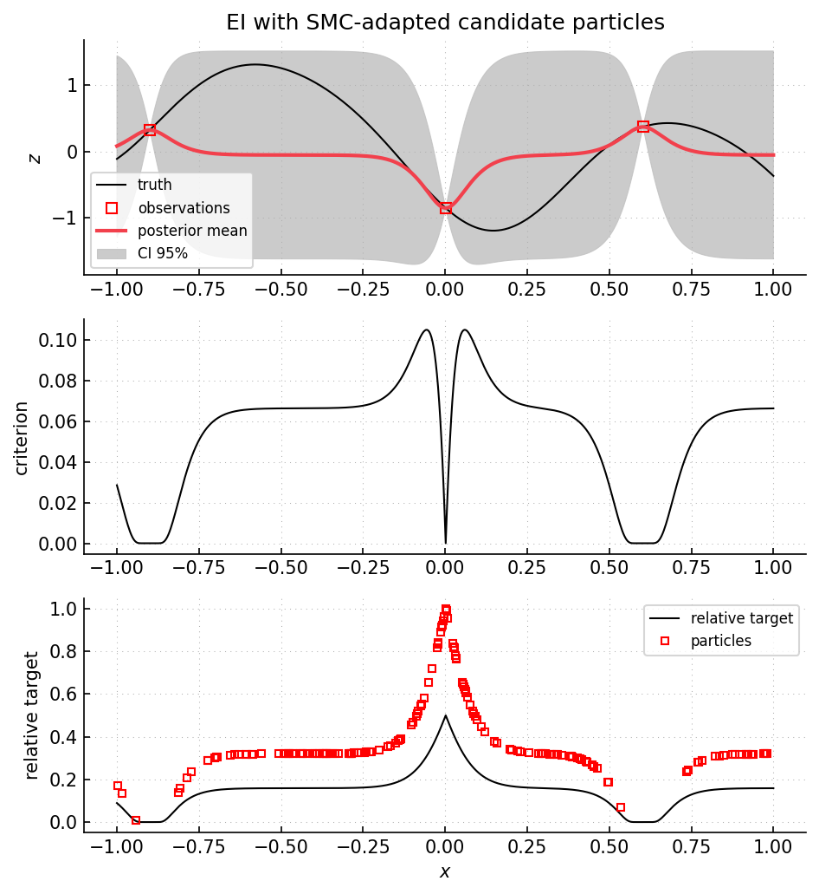

Example 11: expected improvement with SMC search
================================================

Script: ``examples/example11_optim_EI_smc.py``

Purpose
-------

The script runs the same one-dimensional EI loop as ``example10``, but replaces
the fixed candidate grid by an SMC particle set.  The particle set is moved
toward regions where the posterior probability of improvement is not negligible.
This follows the general idea of using SMC particles to represent a sequence of
search targets, as in Bayesian subset simulation :cite:p:`bect2016bss`, while
using the EI criterion introduced for efficient global optimization
:cite:p:`jones1998ego`.

What is computed
----------------

- posterior mean and variance at the current particle positions.
- EI values on the particle set.
- a target log-density proportional to
  ``log P(-Y(x) > -min(zi) | observations)`` inside the input box.
- SMC particle updates using reweighting, resampling, and Markov moves.
- one new objective evaluation per sequential step.

Main objects
------------

- ``gpmpcontrib.optim.expectedimprovement.ExpectedImprovementSMC``
- ``gpmpcontrib.SequentialStrategySMC``
- ``gpmp.mcmc.smc.SMC``

Outputs
-------

Run ``python examples/example11_optim_EI_smc.py`` from the repository root to
execute the example.  Regenerate the static figure with
``cd docs && python make_example_results.py``.

   Top panel: GP posterior from the current observations.  Middle panel: EI on
   a dense plotting grid.  Lower panel: improvement-probability profile with SMC
   particles.  Particle heights show the target density up to a multiplicative
   constant.  Particles concentrate where the improvement probability is not
   close to zero.

Source excerpt
--------------

.. literalinclude:: ../../../examples/example11_optim_EI_smc.py
   :language: python
   :lines: 100-129
