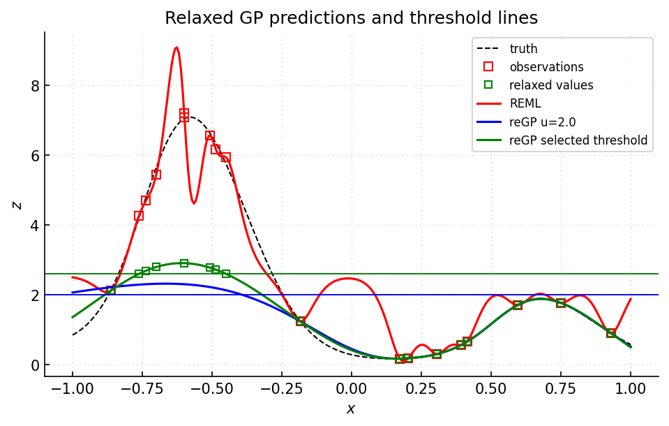

Example 20: relaxed Gaussian process
====================================

Script: ``examples/example20_regp.py``

Purpose
-------

The script demonstrates relaxed Gaussian-process (reGP) remodeling for a
threshold-oriented target.  Selected observations are allowed to move inside a
relaxation interval, and the relaxed values are optimized together with
covariance parameters before prediction.  See :cite:t:`petit2025regp` for the
method.

What is computed
----------------

- an initial GP model and posterior predictions.
- membership of observations in the relaxation interval.
- relaxed observation values and updated covariance parameters.
- posterior predictions from the relaxed model.
- a selected relaxation threshold based on a tCRPS criterion.
- a plot comparing observations, relaxed observations, and predictions.

Main objects
------------

- ``gpmpcontrib.regp.regp.predict``
- ``gpmpcontrib.regp.regp.remodel``
- ``gpmpcontrib.regp.regp.select_optimal_threshold_above_t0``

Outputs
-------

Run ``python examples/example20_regp.py`` from the repository root to execute
the example.  Regenerate the static figure with
``cd docs && python make_example_results.py``.

   Black dashed curve: reference function.  Red curve: initial REML posterior
   mean.  Blue and green curves: reGP posterior means obtained after relaxing
   observations above the corresponding horizontal thresholds.  Green points:
   relaxed observation values used by the selected-threshold reGP model.

Source excerpt
--------------

.. literalinclude:: ../../../examples/example20_regp.py
   :language: python
   :lines: 89-112
