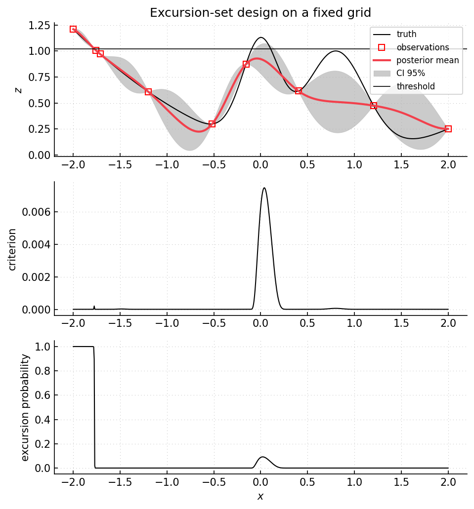

Example 30: excursion set on a fixed grid
=========================================

Script: ``examples/example30_excursionset_gridset.py``

Purpose
-------

The script estimates a one-dimensional excursion set on a fixed grid.  The
target set is

.. math::

   \Gamma_u = \{x : f(x) > u_\mathrm{target}\}.

New evaluations are selected by an excursion-set criterion evaluated on the
grid.  Excursion probabilities and related criteria also appear in constrained
Bayesian optimization :cite:p:`feliot2017constrained`.

What is computed
----------------

- posterior mean and variance on the fixed grid.
- excursion probabilities ``P(Y(x) > u_target | observations)``.
- excursion misclassification quantities.
- ``excursion_wMSE`` values used for selecting the next grid point.
- expected excursion volume and expected misclassification summaries through the
  strategy object.

Main objects
------------

- ``gpmpcontrib.optim.excursionset.ExcursionSetGridSearch``
- ``gpmpcontrib.samplingcriteria.excursion_probability``
- ``gpmpcontrib.samplingcriteria.excursion_misclassification_probability``
- ``gpmpcontrib.samplingcriteria.excursion_wMSE``

Outputs
-------

Run ``python examples/example30_excursionset_gridset.py`` from the repository
root to execute the example.  Regenerate the static figure with
``cd docs && python make_example_results.py``.

   Top panel: target excursion threshold, observations, and GP posterior.
   Middle panel: ``excursion_wMSE`` criterion on the grid.  Its largest values
   occur near uncertain threshold crossings, where additional observations can
   change the estimated excursion set.  Lower panel: posterior probability of
   exceeding the target threshold.

Source excerpt
--------------

.. literalinclude:: ../../../examples/example30_excursionset_gridset.py
   :language: python
   :lines: 104-146
