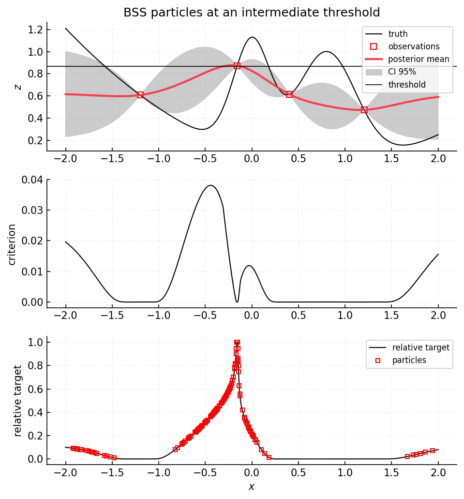

Example 31: excursion set with BSS-style SMC search
===================================================

Script: ``examples/example31_excursionset_smc.py``

Purpose
-------

The script estimates an excursion set with ``ExcursionSetBSS``.  It replaces the
fixed grid of ``example30`` by a particle population.  The particle target is
controlled by an interpolation parameter ``mu`` between an initial threshold and
the final excursion threshold.  The construction is related to Bayesian subset
simulation :cite:p:`bect2016bss`.

What is computed
----------------

- posterior mean and variance at particle positions.
- the threshold ``u(mu) = (1 - mu) * u_init + mu * u_target``.
- a target log-density proportional to
  ``log P(Y(x) > u(mu) | observations)`` inside the input box.
- SMC reweighting, resampling, and Markov moves of the particle population.
- excursion probabilities and excursion-set criteria at the current threshold.

Main objects
------------

- ``gpmpcontrib.optim.excursionset.ExcursionSetBSS``
- ``gpmpcontrib.SequentialStrategyBSS``
- ``gpmp.mcmc.smc.SMC``

Outputs
-------

Run ``python examples/example31_excursionset_smc.py`` from the repository root
to execute the example.  Regenerate the static figure with
``cd docs && python make_example_results.py``.

   Intermediate threshold with ``mu = 0.85``.  Top panel: current GP posterior
   and observations.  Middle panel: excursion-set criterion at the current
   threshold.  Lower panel: excursion probability with SMC particles.  Particle
   heights show the current target density up to a multiplicative constant.

Source excerpt
--------------

.. literalinclude:: ../../../examples/example31_excursionset_smc.py
   :language: python
   :lines: 185-220
