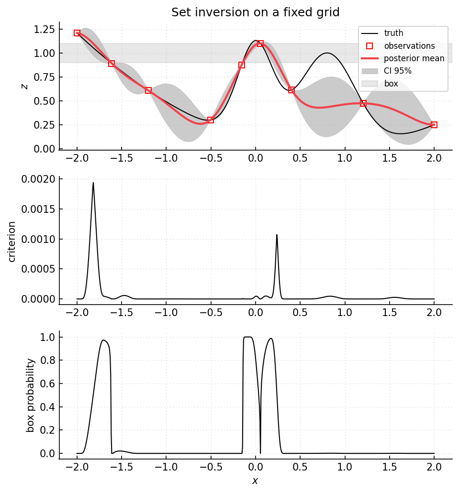

Example 40: set inversion on a fixed grid
=========================================

Script: ``examples/example40_setinversion_gridset.py``

Purpose
-------

The script estimates the inverse image of an output-space box on a fixed input
grid.  The target set is

.. math::

   \Gamma_B = \{x : f(x) \in B\}.

At each step, posterior box-membership probabilities and a box weighted-MSE
criterion are evaluated on the grid.  The box-membership probability is the
same type of Gaussian probability used for constrained Bayesian optimization
:cite:p:`feliot2017constrained`.

What is computed
----------------

- posterior mean and variance on the fixed grid.
- box-membership probabilities ``P(Y(x) in B | observations)``.
- ``box_wMSE`` values used for selecting the next grid point.
- one new evaluation per sequential step.

Main objects
------------

- ``gpmpcontrib.optim.setinversion.SetInversionGridSearch``
- ``gpmpcontrib.samplingcriteria.box_probability``
- ``gpmpcontrib.samplingcriteria.box_wMSE``

Outputs
-------

Run ``python examples/example40_setinversion_gridset.py`` from the repository
root to execute the example.  Regenerate the static figure with
``cd docs && python make_example_results.py``.

   Top panel: target output box, observations, and GP posterior.  Middle panel:
   criterion used to select new evaluations.  Lower panel: posterior
   probability that the function belongs to the target box at each input
   location.

Source excerpt
--------------

.. literalinclude:: ../../../examples/example40_setinversion_gridset.py
   :language: python
   :lines: 27-76
