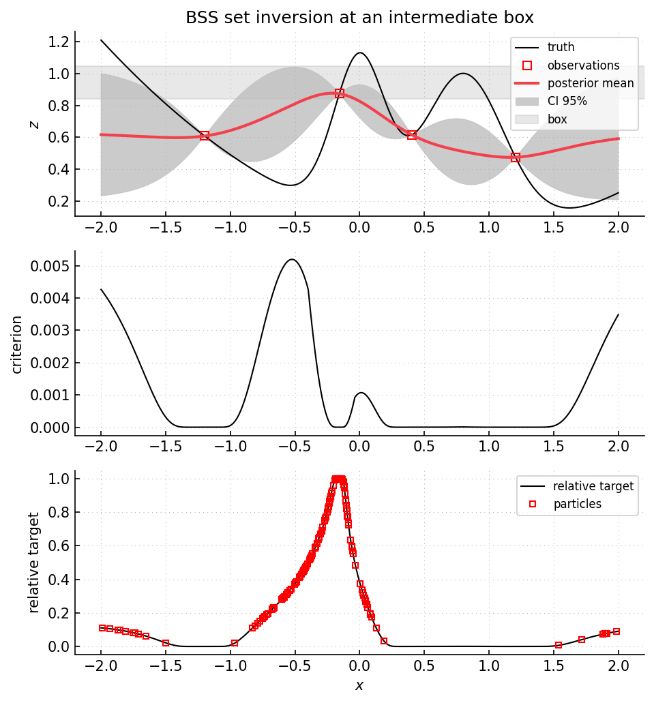

Example 41: set inversion with BSS-style particles
==================================================

Script: ``examples/example41_setinversion_smc.py``

Purpose
-------

The script estimates an inverse image with ``SetInversionBSS``.  It replaces the
fixed grid of ``example40`` by a particle population and moves from an initial
box to a target box through an interpolation parameter ``mu``.  The particle
update follows the BSS idea of representing a sequence of probability targets
:cite:p:`bect2016bss`.  The box probabilities are the same type of Gaussian
probabilities used in constrained Bayesian optimization
:cite:p:`feliot2017constrained`.

What is computed
----------------

- posterior mean and variance at particle positions.
- the intermediate box ``B(mu) = (1 - mu) B_init + mu B_target``.
- a target log-density proportional to box-membership probability inside the
  input box.
- SMC reweighting, resampling, and Markov moves of the particle population.
- box-membership probabilities and box weighted-MSE values at the current box.

Main objects
------------

- ``gpmpcontrib.optim.setinversion.SetInversionBSS``
- ``gpmpcontrib.SequentialStrategyBSS``
- ``gpmp.mcmc.smc.SMC``

Outputs
-------

Run ``python examples/example41_setinversion_smc.py`` from the repository root
to execute the example.  Regenerate the static figure with
``cd docs && python make_example_results.py``.

   Intermediate output box with ``mu = 0.85``.  Lower panel: box-membership
   probability with SMC particles.  Particle heights show the current target
   density up to a multiplicative constant.

Source excerpt
--------------

.. literalinclude:: ../../../examples/example41_setinversion_smc.py
   :language: python
   :lines: 28-75
