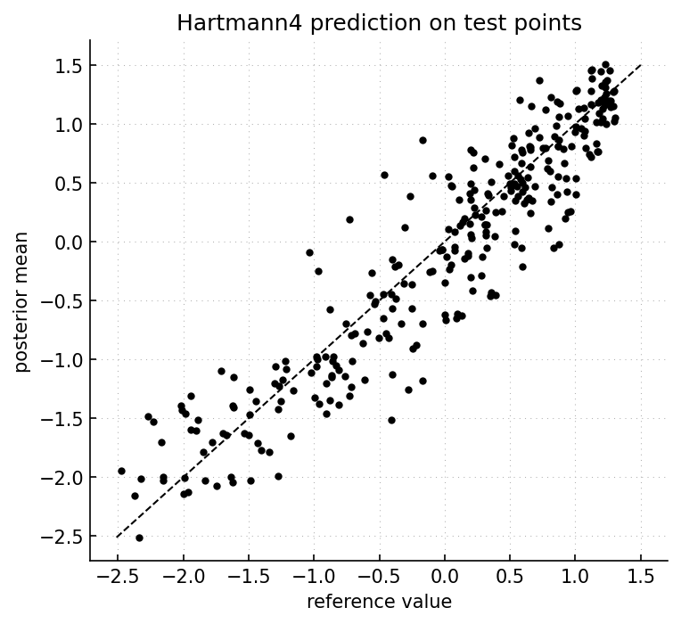

Getting started
===============

The first example builds a ``gpmp-contrib`` model from observation points.  It
uses the four-dimensional Hartmann function, as in the core ``gpmp`` tutorial.
The first displayed output is a predicted-versus-reference check on test
points.

The example runs these operations:

1. choose a ``ComputerExperiment``.
2. choose observation points and evaluate the experiment.
3. create a Matérn model container.
4. select covariance parameters.
5. predict at test points.
6. inspect diagnostics and stored model state.

Model construction
------------------

.. code-block:: python

   import gpmp as gp
   import gpmp.num as gnp
   import gpmpcontrib as gpc

   gnp.set_seed(1234)

   problem = gpc.test_problems.hartmann4
   box = problem.input_box

   xi = gp.misc.designs.ldrandunif(problem.input_dim, 40, box)
   zi = problem(xi)

   xt = gp.misc.designs.ldrandunif(problem.input_dim, 300, box)
   zt = problem(xt)

   model = gpc.Model_ConstantMean_Maternp_REML(
       "hartmann4",
       output_dim=problem.output_dim,
       mean_specification={"type": "constant"},
       covariance_specification={"p": 3},
   )

   model.select_params(xi, zi)
   zpm, zpv = model.predict(xi, zi, xt)
   print(zpm.shape, zpv.shape)

   model.run_diagnosis(xi, zi)
   model.run_perf(xi, zi, xtzt=(xt, zt), zpmzpv=(zpm, zpv))

   param = model[0].get_param()
   covparam = model[0]["model"].covparam
   info = model[0]["info"]

The call to ``gnp.set_seed`` makes the design reproducible.  The prediction
arrays are NumPy arrays by default because ``ModelContainer.predict`` uses
``convert_out=True``.

Objects and stored state
------------------------

``problem``
    The ``ComputerExperiment``.  It stores the input box, input dimension,
    output dimension, and callable function.  Built-in test problems are
    available in ``gpmpcontrib.test_problems``.

``xi`` and ``zi``
    Observation points and observed values.  Here ``xi`` has shape ``(40, 4)``.
    For this scalar-output problem, ``zi`` has one column.

``xt`` and ``zt``
    Test points and reference values.  They are used only to check predictions.
    They are not used during parameter selection.

``model``
    A ``ModelContainer`` subclass.  It stores one ``gpmp.core.Model`` per
    output.  Here there is only one output, so output ``0`` stores the
    Hartmann4 GP model.

``select_params``
    Builds the REML criterion, chooses an optimizer start, runs SciPy, and
    stores the selected covariance parameters.

``predict``
    Computes posterior means and variances at the test points ``xt``.

Expected output
---------------

The exact optimizer values depend on the random design and on the active
numerical backend.  The prediction shapes are fixed:

.. code-block:: text

   (300, 1) (300, 1)

This line is produced by ``print(zpm.shape, zpv.shape)`` in the code above.

The diagnosis output has one block per output:

.. code-block:: text

   ~ Model [0]
   [Model diagnosis]
     * Parameter selection
       cvg_reached: True
       optimal_val: True
       ...
     * Parameters
       ...
     * Data
       count: 40

This block is produced by ``model.run_diagnosis(xi, zi)``.

``cvg_reached`` is the SciPy optimizer success flag.  ``optimal_val`` means that
the final criterion value is finite and usable.  The parameter table prints raw
coordinates and denormalized values.  For Matérn lengthscales, the raw vector
stores ``-log(rho)`` while the denormalized column reports ``rho``.

Prediction check
----------------

The code below produces the prediction check from ``zt`` and ``zpm``:

.. code-block:: python

   import gpmp as gp

   zt_ = zt.reshape(-1)
   zpm_ = zpm.reshape(-1)
   zmin = min(float(zt_.min()), float(zpm_.min()))
   zmax = max(float(zt_.max()), float(zpm_.max()))

   fig = gp.plot.Figure()
   fig.plot(zt_, zpm_, "ko", markersize=3)
   fig.plot([zmin, zmax], [zmin, zmax], "k--", linewidth=1)
   fig.xylabels("reference value", "posterior mean")
   fig.grid()
   fig.show()

   Posterior mean against reference values on 300 test points.  Points close to
   the diagonal indicate accurate prediction.  Curvature or a large vertical
   spread would indicate bias or large prediction errors.

Inspecting the selected model
-----------------------------

The selected model state is stored per output:

.. code-block:: python

   entry = model[0]
   gp_model = entry["model"]

   covparam = gp_model.covparam
   meanparam = gp_model.meanparam
   param = entry.get_param()
   info = entry["info"]

``covparam`` is the raw covariance vector passed to ``gpmp.kernel``:

.. code-block:: text

   [log(sigma2), -log(rho_0), -log(rho_1), -log(rho_2), -log(rho_3)]

``param`` is the readable ``Param`` object.  It gives names, paths,
normalization rules, bounds, raw values, and denormalized values.  Use it when
inspecting parameters or passing a named optimizer start back to
``select_params``.

``info`` is the optimizer report.  It also stores
``selection_criterion_nograd``, which is the criterion callable to use for
plots, diagnosis, and posterior parameter sampling when gradients are not
needed.

Checking prediction performance
-------------------------------

``run_perf`` prints leave-one-out and test-set summaries:

.. code-block:: python

   model.run_perf(xi, zi, xtzt=(xt, zt), zpmzpv=(zpm, zpv))
   zloom, zloov, eloo = model.loo(xi, zi)

The displayed block is produced by
``model.run_perf(xi, zi, xtzt=(xt, zt), zpmzpv=(zpm, zpv))``.  For the seeded
Hartmann4 run above, the output is:

.. literalinclude:: _static/example_results/getting_started_hartmann4_perf.txt
   :language: text

For each output, the displayed quantities are defined as follows.  For
reference values :math:`z_i`,

.. math::

   \mathrm{TSS} = \sum_i (z_i - \bar z)^2.

For leave-one-out prediction, let
:math:`e_i^{\mathrm{LOO}} = z_i - \widehat z_{-i}(x_i)`, where
:math:`\widehat z_{-i}` is computed without observation :math:`i`.  Then

.. math::

   \mathrm{PRESS} = \sum_i \left(e_i^{\mathrm{LOO}}\right)^2,
   \qquad
   Q^2 = 1 - \frac{\mathrm{PRESS}}{\mathrm{TSS}}.

For a test set, let :math:`e_i^{\mathrm{test}} = z_i - \widehat z(x_i)`.  Then

.. math::

   \mathrm{RSS} = \sum_i \left(e_i^{\mathrm{test}}\right)^2,
   \qquad
   R^2 = 1 - \frac{\mathrm{RSS}}{\mathrm{TSS}}.

In both blocks,
:math:`\mathrm{RMSE} = \sqrt{\mathrm{SSE}/n}` with
:math:`\mathrm{SSE}=\mathrm{PRESS}` for LOO and
:math:`\mathrm{SSE}=\mathrm{RSS}` for the test set.  ``std(z)`` is the
empirical standard deviation of the reference values in the block.
``rmse/std(z)`` is a scale-free error.  ``press/tss`` and ``rss/tss`` are
error-to-variance ratios, so smaller values are better.

The LOO ``Q2`` uses the observations.  The test-set ``R2`` uses ``xt`` and
``zt``.  In this run, the independent test score is higher than the LOO score:
LOO removes one of only 40 observations at a time, so it can be more demanding
than prediction on the sampled test set.  If the scores are low, inspect the
design, covariance class, optimizer result, bounds, and parameterization.

Where to go next
----------------

- Read :doc:`guide/models` for the relation between ``ComputerExperiment``,
  ``ModelContainer``, and ``gpmp.core.Model``.
- Read :doc:`guide/model_state` for raw vectors, ``Param`` objects, and
  optimizer reports.
- Read :doc:`guide/parameter_selection` for ML, REML, and REMAP criteria.
- Read :doc:`guide/diagnostics` for diagnosis and LOO interpretation.
- Read :doc:`examples/index` for complete scripts with expected results and
  plots.
